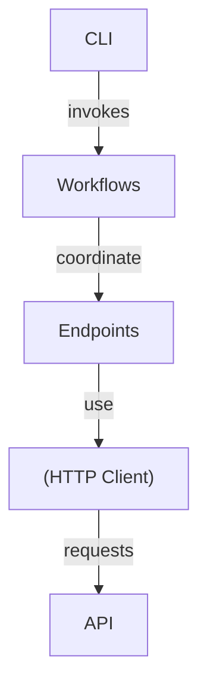

# imednet

<div align="center">
  
</div>

<div align="center">


**Unofficial Python SDK for the iMednet clinical trials API.**

Full documentation: <https://fderuiter.github.io/imednet-python-sdk/>

</div>

<div align="center">

[](https://pypi.org/project/imednet/)
[](https://pypi.org/project/imednet/)
[](https://pypi.org/project/imednet/)
[](https://pypi.org/project/imednet/)
[](LICENSE)
[](https://github.com/fderuiter/imednet-python-sdk/actions/workflows/ci.yml)
[](https://github.com/fderuiter/imednet-python-sdk)

</div>

This package simplifies integration with the iMednet REST API for clinical trial
management. It provides typed endpoint wrappers, helper workflows and a CLI so
researchers and developers can automate data extraction and submission without
reimplementing HTTP logic.

## Features

- **Typed API Endpoints**: A simple, consistent interface for all iMednet API endpoints, with Pydantic models for request and response validation.
- **Automatic Pagination**: Hassle-free iteration over paginated API resources.
- **Intelligent Workflows**: High-level workflows for common tasks like data extraction, record mapping, and query management.
- **Data Export Utilities**: Easily export study data to various formats, including pandas DataFrames, CSV, Excel, and SQL databases.
- **Asynchronous Support**: A fully asynchronous client for high-performance applications.
- **Command-Line Interface**: A powerful CLI for interacting with the iMednet API from the terminal.
- **Robust Error Handling**: A comprehensive exception hierarchy for handling API and network errors.
- **Configurable Retries**: A flexible retry mechanism with exponential backoff.
- **Observability**: Structured JSON logging and OpenTelemetry tracing for monitoring and debugging.

---

## Architecture

The SDK is organized into several layers, each with a distinct responsibility:

- **Client**: The core HTTP client layer, responsible for authentication, request signing, and retry logic.
- **Endpoints**: A set of endpoint wrappers that model the iMednet API, providing a clean, consistent interface for each resource.
- **Workflows**: High-level helpers that orchestrate multiple endpoint calls to perform complex tasks, such as data extraction and mapping.
- **CLI**: A command-line interface built on top of the workflows and endpoints, providing a convenient way to interact with the API from the terminal.



---

## Installation

```bash
# PyPI release
pip install imednet
# Dev version
pip install git+https://github.com/fderuiter/imednet-python-sdk.git@main
```

---

## Quick Start

### Synchronous Example

This example demonstrates how to initialize the SDK and fetch a list of studies.
The `load_config_from_env` function conveniently loads your API keys from
environment variables.

```python
from imednet import ImednetSDK, load_config_from_env
from imednet.utils import configure_json_logging

# Configure structured logging (optional)
configure_json_logging()

# Load credentials from environment variables
cfg = load_config_from_env()

# Initialize the SDK
sdk = ImednetSDK(
    api_key=cfg.api_key,
    security_key=cfg.security_key,
    base_url=cfg.base_url,
)

# Fetch and print the list of studies
print(sdk.studies.list())
```

### Asynchronous Example

For high-performance applications, the SDK provides an async client. This
example shows how to use it within an async context manager.

```python
import asyncio
from imednet import AsyncImednetSDK, load_config_from_env
from imednet.utils import configure_json_logging


async def main() -> None:
    # Configure structured logging (optional)
    configure_json_logging()

    # Load credentials from environment variables
    cfg = load_config_from_env()

    # Initialize the async SDK within a context manager
    async with AsyncImednetSDK(
        api_key=cfg.api_key,
        security_key=cfg.security_key,
        base_url=cfg.base_url,
    ) as sdk:
        # Fetch and print the list of studies asynchronously
        print(await sdk.studies.async_list())


if __name__ == "__main__":
    asyncio.run(main())
```

See [docs/async_quick_start.rst](docs/async_quick_start.rst) for more details.

---

## Configuration

The SDK and CLI read credentials from environment variables such as
`IMEDNET_API_KEY` and `IMEDNET_SECURITY_KEY`. See
[configuration](docs/configuration.rst) for the complete list, optional
settings, and `.env` support. Use `imednet.config.load_config_from_env()` to access
these values in your code.

---

## CLI Usage

The package installs the `imednet` command-line tool, which provides a convenient
way to interact with the iMednet API from your terminal. Use `imednet --help` to
explore the available commands and options.

### List all studies

```bash
imednet studies list
```

### Export records to a CSV file

This example exports all records from the `MY_STUDY` study to a CSV file,
using variable labels for the column headers.

```bash
imednet export csv MY_STUDY records.csv --use-labels
```

### Export a subset of variables to a SQL database

This example exports only the `AGE` and `SEX` variables from forms `10` and `20`
to a SQLite database.

```bash
imednet export sql MY_STUDY records_table sqlite:///data.db --vars AGE,SEX --forms 10,20
```

When the connection string uses SQLite, the command splits the output into one
table per form to avoid the 2000 column limit. Pass `--single-table` to
disable this behaviour. See `docs/cli.rst` for more examples.

---

## SDK Modules

The SDK is organized into the following main modules:

- `imednet.sdk`: The main entry point for the SDK, providing the `ImednetSDK` and `AsyncImednetSDK` classes.
- `imednet.core`: The core HTTP client, authentication, and retry logic.
- `imednet.models`: Pydantic models for all API resources.
- `imednet.endpoints`: Wrappers for each of the iMednet API endpoints.
- `imednet.workflows`: High-level workflows that orchestrate multiple API calls to perform complex tasks.
- `imednet.cli`: The command-line interface.
- `imednet.utils`: General utility functions.
- `imednet.validation`: Schema validation and data dictionary loading.

---

## Documentation & Resources

- **API Documentation**: Full documentation is available at
  <https://fderuiter.github.io/imednet-python-sdk/>.
- **Official iMednet API Docs**: <https://portal.prod.imednetapi.com/>.
- **Postman Collection**: Download
  [`imednet.postman_collection.json`](resources/imednet.postman_collection.json) and import it
  into Postman to explore and test the API endpoints.

---

## Development & Contributing

### Tech Stack

- Python 3.11–3.12
- requests, httpx, pydantic, typer, tenacity, python-dotenv

### Project Structure

```
.
├── docs/       - Sphinx documentation
├── examples/   - Usage samples
├── imednet/    - SDK package
├── scripts/    - Helper scripts
└── tests/      - Unit and integration tests
```

### Testing & Development

```bash
./scripts/setup.sh  # once
poetry run ruff check --fix .
poetry run black --check .
poetry run isort --check --profile black .
poetry run mypy imednet
poetry run pytest -q
```

After running tests, validate documentation builds cleanly (no warnings):

```bash
make docs
```

See [docs/AGENTS.md](docs/AGENTS.md) for full documentation guidelines.

### Smoke-test workflow

The optional [smoke.yml](.github/workflows/smoke.yml) action runs the `tests/live` suite.
It relies on repository secrets `APIKEY` and `SECURITYKEY` and sets `IMEDNET_RUN_E2E`.
Use the workflow to confirm real API access on demand or via its nightly schedule.
INFO-level log messages stream to the terminal during these runs, making it easier to
debug failures.

### Building & Publishing

```bash
python -m build
python -m twine upload dist/*
```

Pushing a Git tag like `v0.1.4` triggers the GitHub Actions workflow that builds
and publishes the package to PyPI.

### Versioning & Changelog

This project follows [Semantic Versioning](https://semver.org). See
[CHANGELOG.md](CHANGELOG.md) for release history.

### Contributing

Contributions are welcome! See the
[contributing guide](docs/contributing.rst) and
[CONTRIBUTING.md](CONTRIBUTING.md) for full details.

---

## License

This project is licensed under the MIT license. See [LICENSE](LICENSE) for
details.

---

## Acknowledgements

Built with open source libraries including requests, httpx, pydantic and typer.

