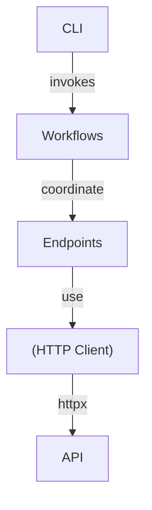

# imednet

**Unofficial Python SDK for the iMednet clinical trials API.**

Full documentation: <https://fderuiter.github.io/imednet-python-sdk/>

</div>

<div align="center">

[](https://pypi.org/project/imednet/)
[](https://pypi.org/project/imednet/)
[](https://pypi.org/project/imednet/)
[](https://pypi.org/project/imednet/)
[](LICENSE)
[](https://github.com/fderuiter/imednet-python-sdk/actions/workflows/ci.yml)
[](https://github.com/fderuiter/imednet-python-sdk)

</div>

This package simplifies integration with the iMednet REST API for clinical trial
management. It provides typed endpoint wrappers, helper workflows and a CLI so
researchers and developers can automate data extraction and submission without
reimplementing HTTP logic.

## Features

- Simple, consistent interface for API calls
- Automatic pagination across endpoints
- Pydantic models for requests and responses
- Workflow helpers for data extraction and mapping
- Pandas and CSV utilities
- Optional in-memory caching of study metadata
- Structured JSON logging and OpenTelemetry tracing
- Async client and command line interface
- **Form Designer**: Pythonic API for building and validating CRFs

---

## Architecture

The SDK is organized around a core HTTP client layer, endpoint wrappers that model
the iMednet API, workflow helpers that combine multiple endpoint calls, and a CLI
built on top of those pieces.


```mermaid
graph TD
    CLI[CLI] --> |invokes| Workflows
    Workflows --> |coordinate| Endpoints
    Endpoints --> |use| Client["(HTTP Client)"]
    Client --> |httpx| API
```

For workspace package boundaries (`packages/core`, `packages/plugins-workflows`,
`packages/providers-airflow`), see [docs/architecture.rst](docs/architecture.rst)
and the contributor contract in [AGENTS.md](AGENTS.md).

---

## Installation

```bash
# PyPI release
pip install imednet
```

### Optional Dependencies

To use export features, workflow plugins, or Airflow provider integrations, install the relevant extras/packages:

```bash
# Install all tabular export dependencies
pip install "imednet[export]"

# Or install destination-specific extras
pip install "imednet[duckdb]"
pip install "imednet[mongodb]"
pip install "imednet[neo4j]"
pip install "imednet[snowflake]"

# Workflow plugin package
pip install imednet-workflows

# Airflow provider package
pip install "apache-airflow>=3.2.0" apache-airflow-providers-imednet apache-airflow-providers-amazon
```

### Version Pinning

Each workspace package is versioned and released independently. To pin specific versions:

```bash
pip install "imednet==0.7.0"
pip install "imednet-workflows==0.5.3"
pip install "apache-airflow-providers-imednet==0.5.2"
```

See [GitHub Releases](https://github.com/fderuiter/imednet-python-sdk/releases) and each package's
`CHANGELOG.md` for release history and version guidance.

### Development Version

```bash
pip install git+https://github.com/fderuiter/imednet-python-sdk.git@main
```

---

## Quick Start

Set your credentials by copying the environment template or exporting them directly:

```bash
# Option 1: Use a .env file (recommended)
cp .env.example .env

# Option 2: Export directly to your shell
export IMEDNET_API_KEY="your_api_key"
export IMEDNET_SECURITY_KEY="your_security_key"
# Optional: Custom base URL for the API endpoint
# export IMEDNET_BASE_URL="https://edc.prod.imednetapi.com"
```

### Synchronous Example

```python
from dotenv import load_dotenv

from imednet import ImednetSDK, load_config
from imednet.utils import configure_json_logging

# Optional: Configure structured JSON logging
configure_json_logging()

# Load credentials from .env file or environment variables
# Note: Ensure you've run `cp .env.example .env` or exported keys to your shell.
load_dotenv()
cfg = load_config()

with ImednetSDK(
    api_key=cfg.api_key,
    security_key=cfg.security_key,
    base_url=cfg.base_url,
) as sdk:
    # List all studies available to the user
    studies = sdk.studies.list()
    for study in studies:
        print(f"{study.study_name} ({study.study_key})")
```

### Asynchronous Example

```python
import asyncio

from dotenv import load_dotenv

from imednet import AsyncImednetSDK, load_config
from imednet.utils import configure_json_logging

async def main() -> None:
    # Optional: Configure structured JSON logging
    configure_json_logging()

    # Load credentials from .env file or environment variables
    # Note: Ensure you've run `cp .env.example .env` or exported keys to your shell.
    load_dotenv()
    cfg = load_config()

    async with AsyncImednetSDK(
        api_key=cfg.api_key,
        security_key=cfg.security_key,
        base_url=cfg.base_url,
    ) as sdk:
        studies = await sdk.studies.async_list()
        for study in studies:
            print(f"{study.study_name} ({study.study_key})")

asyncio.run(main())
```

See [docs/async_quick_start.rst](docs/async_quick_start.rst) for more details.

---

## Configuration

The SDK and CLI read credentials from environment variables such as
`IMEDNET_API_KEY` and `IMEDNET_SECURITY_KEY`. You can set these in your shell or
use a `.env` file. Copy `.env.example` to `.env` to get started.

See [configuration](docs/configuration.rst) for the complete list of options.
Use `imednet.config.load_config()` to access these values in your code.

---

## CLI Usage

The package installs an `imednet` command with subcommands for studies, sites,
subjects, records, jobs, queries and more. Use `imednet --help` to explore all
options.

*(Note: If you are running the project from source or a local clone, make sure to first install dependencies with `poetry install`. Then, prefix commands with `poetry run`, e.g., `poetry run imednet --help`)*

### Data Export

Example of exporting a subset of variables:

```bash
imednet export sql MY_STUDY table sqlite:///data.db --vars AGE,SEX --forms 10,20
```

Examples for new destination families:

```bash
imednet export mongodb MY_STUDY mongodb://localhost:27017 imednet records
imednet export neo4j MY_STUDY bolt://localhost:7687 neo4j "$NEO4J_PASSWORD"
imednet export snowflake MY_STUDY acct user "$SNOWFLAKE_PASSWORD" DB PUBLIC WH STAGE TABLE
```

When the connection string uses SQLite, the command splits the output into one
table per form to avoid the 2000 column limit (in this case, the `table`
argument is ignored). Pass ``--single-table`` to disable this behaviour and use
the specified table name. See ``docs/cli.rst`` for full examples.

---

## Documentation & Resources

- **API Documentation**: Full documentation is available at
  <https://fderuiter.github.io/imednet-python-sdk/>.
- **Official iMednet API Docs**: <https://portal.prod.imednetapi.com/>.
- **Postman Collection**: Download
  [`imednet.postman_collection.json`](imednet.postman_collection.json) and import it
  into Postman to explore and test the API endpoints.

---

## Development & Contributing

### Tech Stack

- Python 3.10–3.12
- httpx, pydantic, typer, tenacity, python-dotenv

### Prerequisites

- [Poetry](https://python-poetry.org/docs/) (for dependency management)
- [Make](https://www.gnu.org/software/make/) (optional, for building docs)

### Project Structure

```
.
├── docs/       - Sphinx documentation
├── examples/   - Usage samples
├── packages/   - Workspace packages
│   ├── core/              - Main SDK package
│   ├── plugins-workflows/ - Workflow plugins package
│   └── providers-airflow/ - Airflow providers package
├── scripts/    - Helper scripts
└── tests/      - Unit and integration tests
```

### Testing & Development

```bash
./scripts/setup.sh  # once
poetry run black --check .
poetry run isort --check --profile black .
poetry run ruff check .
poetry run mypy packages/core/src/imednet
poetry run mypy packages/plugins-workflows/src/imednet_workflows
poetry run mypy packages/providers-airflow/src/apache_airflow_providers_imednet
poetry run pytest -q \
  --cov=imednet \
  --cov=imednet_workflows \
  --cov=apache_airflow_providers_imednet \
  --cov-fail-under=90
```

After running tests, validate documentation builds cleanly (no warnings):

```bash
make docs
```

See [AGENTS.md](AGENTS.md) for the full contributor workflow and quality gate contract.

### Smoke-test workflow

The optional [smoke.yml](.github/workflows/smoke.yml) action runs the `tests/live` suite.
It relies on repository secrets `APIKEY` and `SECURITYKEY` and sets `IMEDNET_RUN_E2E`.
Use the workflow to confirm real API access on demand or via its nightly schedule.
INFO-level log messages stream to the terminal during these runs, making it easier to
debug failures.

### Release Process

Releases are automated with `release-please` in manifest mode:

1. Open a PR with a Conventional Commit title (`feat:`, `fix:`, `docs:`, etc.).
2. Merge to `main` with **Squash and merge** once checks are green.
3. The `Automated Release` workflow updates or opens a Release PR with calculated
   version bumps and changelog updates for packages under `packages/`.
4. Maintainers publish by merging the bot-created Release PR.

Each workspace package has an **independent version and changelog**. Release-please creates
package-specific tags (`imednet-v0.7.0`, `imednet-workflows-v0.5.3`,
`apache-airflow-providers-imednet-v0.5.2`), and the CI publishes only the package whose tag
was pushed.

Do not manually edit versions in `packages/*/pyproject.toml` and do not publish
with manual `build`/`twine` commands from contributor branches.

### Versioning & Changelog

This project follows [Semantic Versioning](https://semver.org). See
[GitHub Releases](https://github.com/fderuiter/imednet-python-sdk/releases) for release history.

### Contributing

Contributions are welcome! See the
[contributing guide](docs/contributing.rst) and
[CONTRIBUTING.md](CONTRIBUTING.md) for full details.

---

## Troubleshooting

**Missing or invalid required environment variable(s)**
If you see an error like `Error: IMEDNET_API_KEY and IMEDNET_SECURITY_KEY environment variables must be set.` (CLI) or `API key and security key are required` (SDK), or an "Unauthorized" or "Forbidden" (403) API error, ensure you have set valid keys in your shell or in a `.env` file in the directory where you run the script (avoid using "dummy" keys). See [Configuration](#configuration).

**Command not found: sphinx-apidoc when running make docs**
If building documentation with `make docs` fails with `Command not found: sphinx-apidoc`, run `poetry install --all-extras` first to install all necessary documentation plugins and dependencies.

**ModuleNotFoundError when running the CLI locally**
If you are running the `imednet` CLI from source (e.g., `poetry run imednet`) and see a `ModuleNotFoundError` (such as `No module named 'imednet'`), ensure you have installed the project dependencies by running `poetry install` in the project root.

---

## License

This project is licensed under the MIT license. See [LICENSE](LICENSE) for
details.

---

## Acknowledgements

Built with open source libraries including httpx, pydantic and typer.
